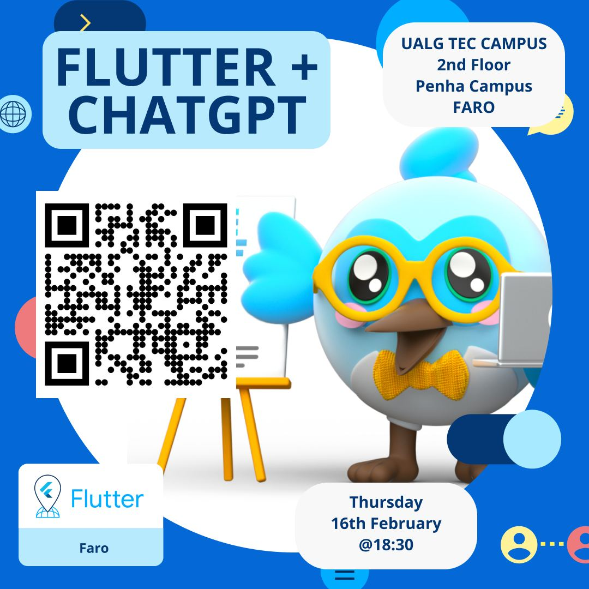
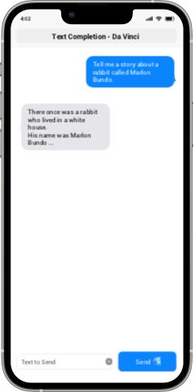

author: FlutterFaro, Tiago Fernandes, Sérgio Henriques, Daniel Jorge
summary: Flutter ChatGPT codelabs 
id: chatgpt-1-codelab
tags: flutter, chatgtp, flutterfaro
categories:
environments: Web
status: Published
feedback link: https://github.com/flutter-faro/codelabs/blob/master/markdown/chatgpt-1-codelab

# Flutter ChatGPT Workshop - FlutterFaro #3

## What you'll learn: Overview

Duration: 180 minutes

This codelab is about creating a Chat app to chat with Open AI.

The idea is to create a simple chat app for the user to be able to interact with different AI models of Open AI.
For the purpose of this workshop we will focus on text completion models (text-davinci) and image models (dall-e)

For the next hours we will be learning about:
* Create a flutter app from scratch
* Structure the flutter app to have a chat interface 
* Create the API mechanism to communicate with Open AI's text-davinci
* Create the API mechanism to communicate with Open AI's images interface (DALL-E)
* Show a Whisper flutter app example



<!-- Negative
: This will appear in a yellow info box.

Positive
: This will appear in a green info box. -->

<!-- ### Bullets
Plain Text followed by bullets
* Hello
* CodeLab
* World

### Numbered List
1. List
1. Using
1. Numbers

### Add an Image or a GIF

 -->

## What you need: Prerequisites

### Prerequisites

Duration: 30 minutes


⚠️ Required materials

Computer with internet access :). For the best experience, the laptop should have [Flutter](https://www.flutter.dev/) installed on it prior to starting the codelab to save time. Windows/Linux/Mac would all be fine.

Check out: [Install Flutter](https://flutter.dev/docs/get-started/install)
After you should be able to run `flutter doctor` without any errors.

A device and cable to connect to the laptop (iOS or Android ) OR an Emulator (iOS or Android). For Android you can install [Android Studio](https://developer.android.com/studio) or the "Command line tools only". 

[VS Code](https://code.visualstudio.com/) installed with Dart and Flutter Extensions.

<!-- 
### Add a Link
Add a link!
[Example of a Link](https://www.google.com)

### Embed an iframe


-->

## Create Flutter App

Make sure to run "flutter doctor" to check if everything is ok and there are no problems with your flutter installation.

To create a new flutter app, just run 

```flutter create chatty```

If all runs properly...


And test run the app by executing
```cd chatty; flutter run```

You should now have your Flutter demo app running.

## Prepare ChatGPT stuff

We are going to create an app called Chatty. 

### Chatty will be responsible for relaying our communications to OpenAI:
1. Set up a simple screen with a text input, a button that sends the text prompt
2. Set AppBar, identifying our AI model we're talking to.
3. Set up the screen with the chat's history, composed of bubbles. Our messages appear on bubbles from the right side. Open AI's messages appear on bubbles comming from the left side.



Lets create a ```StatefulWidget``` called 'ChatView' this will be our screen to hold the message bubbles and the input to request.

On creating a new ```StatefulWidget``` you should have something this:

```
class ChatView extends StatefulWidget {
    const ChatView({Key? key}) : super(key: key);

    @override
    State<ChatView> createState() => _ChatViewState();
}
```

```
class _ChatViewState extends State<ChatView> {
    
    @override
    Widget build(BuildContext context) {
        ....
    }
}
```

## ChatView

So you have created a new ```StatefulWidget```, now lets complete it, whats missing?

Right, so we need to add a ListView to hold the message bubbles and a TextField.

```
class _ChatViewState extends State<ChatView> {
    
    @override
    Widget build(BuildContext context) {
        return Scaffold(
            appBar: AppBar(
                title: const Text("Chat"),
            ),
            body: Column(
                children: [
                    ListView.builder(
                        itemCount: 0,
                        itemBuilder: (BuildContext context, int index) {

                        }),
                    TextFormField()
            ]));
    }
}
```

Hmm 🤔 is this all? 

Hehe of course its still imcomplete, lets think, we need somehow to store the messages to be presented and
added to the ListView.

Ok no problem!

Lets create a List data ```final List<String> _messages```

```
class _ChatViewState extends State<ChatView> {

    final List<String> _messages = [];

    @override
    Widget build(BuildContext context) {
        ....
}

```

Ok, try to do a hot reload to apply the changes.

So, now we need to focus on the TextField to listen for keyboard changes:

```
class _ChatViewState extends State<ChatView> {

    final List<String> _messages = [];

    @override
    Widget build(BuildContext context) {
        ....
        ListView.builder(...),
        TextFormField(

            /// add this:
            textInputAction: TextInputAction.done,
            onFieldSubmitted: (value) {

            }
        )
        ....
}
```


## Open AI's API Flow

To give you an idea of what will happen, this flow show's the process
for requesting the API:


## Connecting to API

Now is the fun part, requesting stuff!!!

1. Lets create a new function for doing the request, you can create this funtion below the ```Widget build(BuildContext context) {}``` and name it 'request' and recieves a String as the only argument.
For doing the requests we'll use the package 'Dio', we need to add the package into our pubspec.yaml.

For the function:

```
void request(String prompt) {

    Dio client = Dio();
    client.options.baseUrl = "https://api.openai.com/v1/";

    /// Set API token
    String token = "";

    final headers = <String, Object>{};
    headers[HttpHeaders.authorizationHeader] = "Bearer ${token}";
    headers[HttpHeaders.acceptHeader] = 'application/json';
    headers[HttpHeaders.contentTypeHeader] = 'application/json';

    client.options.headers.addAll(headers);

    var response = await client.post("completions", data: {
      "model": "text-davinci-003",
      "prompt": prompt,
      "max_tokens": 1500,
      "stop": ["You:"]
    });
    print("response: $response");
}

```

We are almost there...

## Handle API response

Ok so far, we have the screen view, with ListView and TextField, and are able to request the API, therefor we need to handle the response and update the UI.

Easy challenge....

```
void request(String prompt) {
    ...
    var response = await client.post("completions", data: {
    ...
    print("response: $response");

    /// lets parse the response
    var json = response.data as Map<String, dynamic>;
    var message = json["choices"][0]["text"];
    
    print("message: $message");
    // so message is the reponse string
}
```

Now that we can parse the response lets continue to update the UI

```
void request(String prompt) {
    ...
    print("message: $message");
    // so message is the reponse string

    setState(() {
      _messages2.add(message);
    });
}
```

And finnally we need to add a widget to the ListView to see something:

```
class _ChatViewState extends State<ChatView> {

    final List<String> _messages = [];

    @override
    Widget build(BuildContext context) {
        ....
        ListView.builder(
            itemCount: 0,
            itemBuilder: (BuildContext context, int index) {
                    String item = _messages.elementAt(index);

                    return Container(
                      color: Colors.blue,
                      child: Text("$item"),
                    );
            }),
        ),
        ...
```

## Ok. we go so far!

How can we tweak it a bit to make it like an chat app?


## Running the app

...

## Takeaways

Hope you had some fun creating this app! 

Thank you for participaging in this codelab! 

If you have any feedback, don't esitate and contact us, we welcome feedback :)


