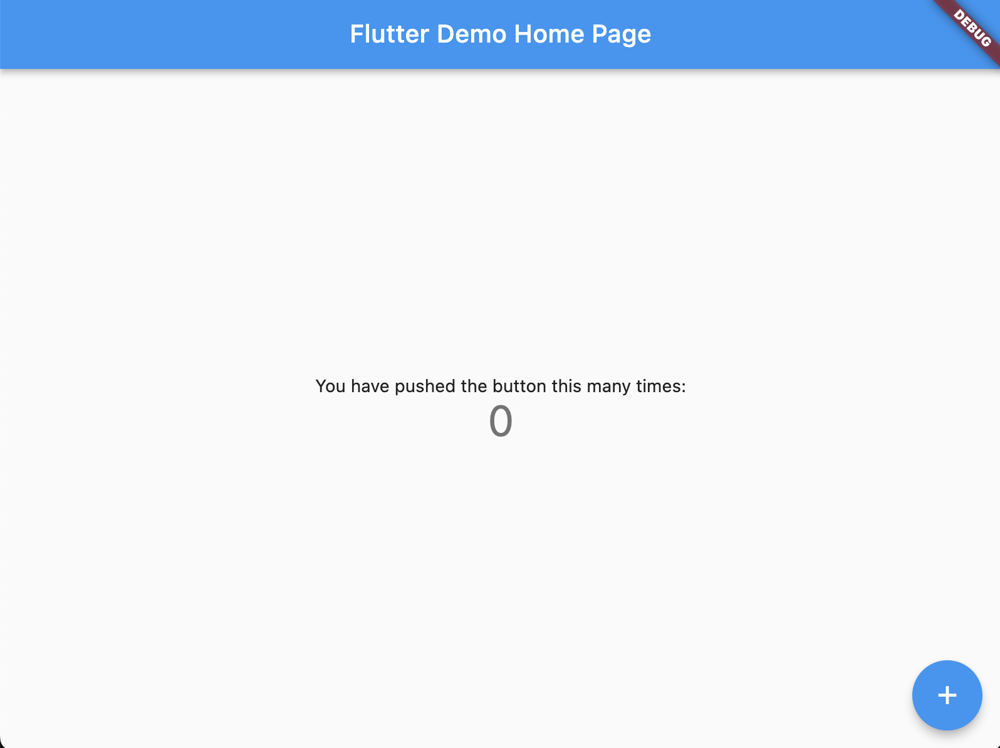

author: Tiago Fernandes
summary:
id: chatgpt-1-codelab
tags:
categories:
environments: Web
status: Published
feedback link: https://github.com/flutter-faro/codelabs/blob/master/markdown/chatgpt-1-codelab

# Flutter ChatGPT Workshop - FlutterFaro #3

## What you'll learn: Overview

Duration: <TIME in min>

This codelab ...

The idea is to create ...

For the next hours we will be learning about how to ... :
* step1...
* step2...
* ...
* ...
* ...

User will see on the screen... 


Then by pressing/inserting text/input ...


<!-- Negative
: This will appear in a yellow info box.

Positive
: This will appear in a green info box. -->

<!-- ### Bullets
Plain Text followed by bullets
* Hello
* CodeLab
* World

### Numbered List
1. List
1. Using
1. Numbers

### Add an Image or a GIF

 -->

## What you need: Prerequisites

### Prerequisites

Duration: <TIME in minutes>


⚠️ Required materials

Computer with internet access :). For the best experience, the laptop should have [Flutter](https://www.flutter.dev/) installed on it prior to starting the codelab to save time. Windows/Linux/Mac would all be fine.

Check out: [Install Flutter](https://flutter.dev/docs/get-started/install)
After you should be able to run `flutter doctor` without any errors.

A device and cable to connect to the laptop (iOS or Android ) OR an Emulator (iOS or Android). For Android you can install [Android Studio](https://developer.android.com/studio) or the "Command line tools only". 

[VS Code](https://code.visualstudio.com/) installed with Dart and Flutter Extensions.

<!-- 
### Add a Link
Add a link!
[Example of a Link](https://www.google.com)

### Embed an iframe


-->

## Create Flutter App

Make sure to run "flutter doctor" to check if everything is ok and there are no problems with your flutter installation.

To create a new flutter app, just run 

```flutter create flutter_geo_quiz```

If all runs properly...


And test run the app by executing
```cd flutter_geo_quiz; flutter run```

You should now have your Flutter demo app running.



## Prepare ChatGPT stuff


```
CODE
```


## Connecting to ...


## ...

## ...


## ...


## Running the app

...

## Takeaways

Hope you had some fun creating this app! 

Thank you for participaging in this codelab! 

If you have any feedback, don't esitate and contact us, we welcome feedback :)


