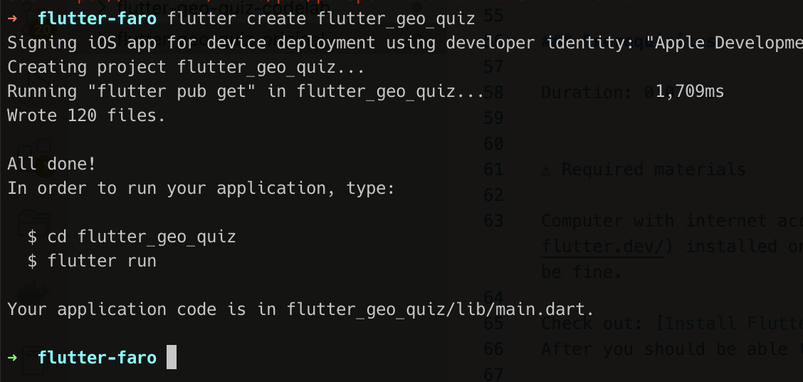

author: Tiago Fernandes
summary:
id: chatgpt-1-codelab
tags:
categories:
environments: Web
status: Published
feedback link: https://github.com/flutter-faro/codelabs/blob/master/markdown/chatgpt-1-codelab

# Flutter ChatGPT Workshop - FlutterFaro #3

## What you'll learn: Overview

Duration: 180 minutes

This codelab is about creating a Chat app for us to talk with Open AI.

The idea is to create a simple chat app for the user to be able to interact with different AI models of Open AI.
For the purpose of this workshop we will focus on text completion models (text-davinci) and image models (dall-e)

For the next hours we will be learning about how to create a AI chat app :
* Create a flutter app from scratch
* Structure the flutter app to have a chat interface 
* Create the API mechanism to communicate with Open AI's text-davinci
* Create the API mechanism to communicate with Open AI's images interface (DALL-E)
* Show a Whisper flutter app example

User will see on the screen... 


Then by pressing/inserting text/input ...


<!-- Negative
: This will appear in a yellow info box.

Positive
: This will appear in a green info box. -->

<!-- ### Bullets
Plain Text followed by bullets
* Hello
* CodeLab
* World

### Numbered List
1. List
1. Using
1. Numbers

### Add an Image or a GIF

 -->

## What you need: Prerequisites

### Prerequisites

Duration: 30 minutes


⚠️ Required materials

Computer with internet access :). For the best experience, the laptop should have [Flutter](https://www.flutter.dev/) installed on it prior to starting the codelab to save time. Windows/Linux/Mac would all be fine.

Check out: [Install Flutter](https://flutter.dev/docs/get-started/install)
After you should be able to run `flutter doctor` without any errors.

A device and cable to connect to the laptop (iOS or Android ) OR an Emulator (iOS or Android). For Android you can install [Android Studio](https://developer.android.com/studio) or the "Command line tools only". 

[VS Code](https://code.visualstudio.com/) installed with Dart and Flutter Extensions.

<!-- 
### Add a Link
Add a link!
[Example of a Link](https://www.google.com)

### Embed an iframe


-->

## Create Flutter App

Make sure to run "flutter doctor" to check if everything is ok and there are no problems with your flutter installation.

To create a new flutter app, just run 

```flutter create flutter_geo_quiz```

If all runs properly...



And test run the app by executing
```cd flutter_geo_quiz; flutter run```

You should now have your Flutter demo app running.


## Prepare ChatGPT stuff

We are going to create an app called Chatty. 

### Chatty will be responsible for relaying our communications to OpenAI:
1. Set up a simple screen with a text input, a button that sends the text prompt
2. Set a bar on top, identifying our AI model we're talking to.
3. Set up the screen with the chat's history, composed of bubbles. Our messages appear on bubbles from the right side. Open AI's messages appear on bubbles comming from the left side.


```
CODE
```


## Connecting to Open AI's API


## ...

## ...


## ...


## Running the app

...

## Takeaways

Hope you had some fun creating this app! 

Thank you for participaging in this codelab! 

If you have any feedback, don't esitate and contact us, we welcome feedback :)


