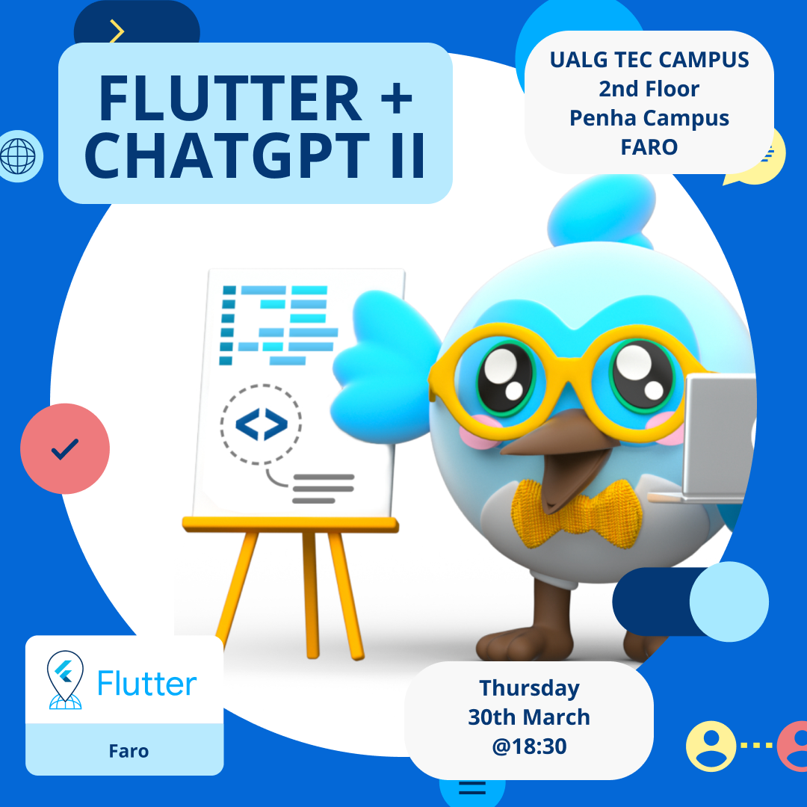
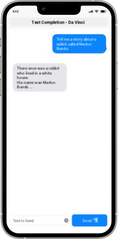
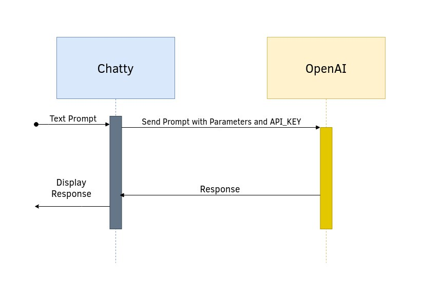
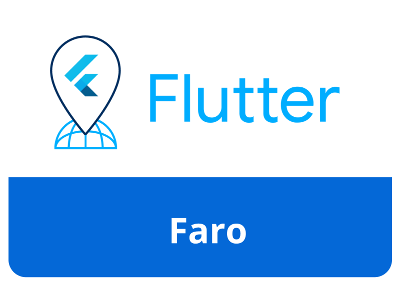

author: FlutterFaro, Tiago Fernandes, Sérgio Henriques, Daniel Jorge
summary: Flutter ChatGPT + Whisper codelabs 
id: chatgpt-2-codelab
tags: flutter, chatgtp, flutterfaro
categories:
environments: Web
status: Published
feedback link: https://github.com/flutter-faro/codelabs/blob/master/markdown/chatgpt-2-codelab

# Flutter ChatGPT + Whisper Workshop - FlutterFaro #4

## What you'll learn: Overview

Duration: 180 minutes

This codelab is about to extend the previously created [Chat app](https://flutter-faro.github.io/codelabs/chatgpt-1-codelab/index.html) to talk with Open AI.

The idea is to add the capacity for the Chat app to transcript speech-to-text to interact with ChatGPT using voice prompts.

For the purpose of this workshop we will focus on using previously created [Chat app](https://flutter-faro.github.io/codelabs/chatgpt-1-codelab/index.html) and extend modules, service interface to connect to [OpenAI Whisper model](https://platform.openai.com/docs/guides/speech-to-text).

For the next hours we will be learning about:
* Create a flutter app from scratch
* About Chatty flutter app Structure and interface 
* Create the API mechanism to communicate with Open AI's Whisper model
* Show a Whisper flutter app example



## What you need: Prerequisites

### Prerequisites

Duration: 30 minutes


⚠️ Required materials

- Computer with internet access :). For the best experience, the laptop should have [Flutter](https://www.flutter.dev/) installed on it prior to starting the codelab to save time. Windows/Linux/Mac would all be fine.

- Check out [Install Flutter](https://flutter.dev/docs/get-started/install). After you should be able to run `flutter doctor` without any errors.

- A device and cable to connect to the laptop (iOS or Android ) OR an Emulator (iOS or Android). For Android you can install [Android Studio](https://developer.android.com/studio) or the "Command line tools only". 

- [VS Code](https://code.visualstudio.com/) installed with Dart and Flutter Extensions.

## Create Flutter App

Make sure to run "flutter doctor" to check if everything is ok and there are no problems with your flutter installation.

To create a new flutter app, just run 

```flutter create chatty```

If all runs properly...


And test run the app by executing
```cd chatty; flutter run```

You should now have your Flutter demo app running.


Add packages to flutter pubspec.yaml file:

```
...

dependencies
  http: ^0.13.5
  dio: ^5.1.0
  jumping_dot: ^0.0.4

  path_provider: ^2.0.14
  provider: ^6.0.5

  envied: ^0.3.0
  record: ^4.4.4

...

dev_dependencies:
  
  flutter_lints: ^2.0.0
  envied_generator: ^0.3.0
  build_runner: ^2.3.3

...
```

Use VS code to get dependencies or run `flutter pub get` from inside chatty project folder.

Create the `.env` file inside project root directory:
```
// .env
OPEN_AI_API_KEY=<YOUR_OPEN_API_KEY>

```

## Prepare ChatGPT stuff

We are going to create an app called Chatty. 

### Chatty will be responsible for relaying our communications to OpenAI:
1. Set up a simple screen with a text input, a button that sends the text prompt
2. Set AppBar, identifying our AI model we're talking to.
3. Set up the screen with the chat's history, composed of bubbles. Our messages appear on bubbles from the right side. Open AI's messages appear on bubbles comming from the left side.



Lets create a ```StatefulWidget``` called 'ChatView' this will be our screen to hold the message bubbles and the input to request.

When creating a new ```StatefulWidget``` you should have something this:

```
class ChatView extends StatefulWidget {
    const ChatView({Key? key}) : super(key: key);

    @override
    State<ChatView> createState() => _ChatViewState();
}
```

```
class _ChatViewState extends State<ChatView> {
    
    @override
    Widget build(BuildContext context) {
        ....
    }
}
```

## ChatView

So you have created a new ```StatefulWidget```, now lets complete it, whats missing?

Right, we need to add a ListView to hold the message bubbles and a TextField.

```
class _ChatViewState extends State<ChatView> {
    
    @override
    Widget build(BuildContext context) {
        return Scaffold(
            appBar: AppBar(
                title: const Text("Chat"),
            ),
            body: Column(
                children: [
                    ListView.builder(
                        itemCount: 0,
                        itemBuilder: (BuildContext context, int index) {

                        }),
                    TextFormField()
            ]));
    }
}
```

Hmm 🤔 is this all? 

Hehe of course its still incomplete, lets think, we need to store somehow the messages. This will then be used to add to the ListView so that messages are presented.

Ok no problem!

Lets create a List data ```final List<String> _messages```

```
class _ChatViewState extends State<ChatView> {

    final List<String> _messages = [];

    @override
    Widget build(BuildContext context) {
        ....
}

```

Ok, try to do a hot reload to apply the changes.

Now we need to focus on the TextField that will listen to the keyboard changes:

```
class _ChatViewState extends State<ChatView> {

    final List<String> _messages = [];

    @override
    Widget build(BuildContext context) {
        ....
        ListView.builder(...),
        TextFormField(

            /// add this:
            textInputAction: TextInputAction.done,
            onFieldSubmitted: (value) {

            }
        )
        ....
}
```


<!-- ## Open AI's API Flow

To give you an idea of what will happen, this flow show's the process
for requesting the API:

 -->


## Connecting to API

Now the fun part, requesting stuff!!!

Lets create a new function for doing the request, you can create this funtion below the 

```Widget build(BuildContext context) {}``` 

and name it `request`. It recieves a String as the only argument.

For doing the requests we'll use the package `Dio`, we need to add the package to chatty. Run `flutter pub add dio` or update pubspec.yaml and run 'flutter pub get' or use VS code to get dependencies.


For the function:


```
void request(String prompt) {

    Dio client = Dio();
    client.options.baseUrl = "https://api.openai.com/v1/";

    /// Set API token
    String token = "";

    final headers = <String, Object>{};
    headers[HttpHeaders.authorizationHeader] = "Bearer ${token}";
    headers[HttpHeaders.acceptHeader] = 'application/json';
    headers[HttpHeaders.contentTypeHeader] = 'application/json';

    client.options.headers.addAll(headers);

    var response = await client.post("completions", data: {
      "model": "text-davinci-003",
      "prompt": prompt,
      "max_tokens": 1500,
      "stop": ["You:"]
    });
    print("response: $response");
}

```


We are almost there...

## Handle API response

Ok so far, we have the screen view, with ListView and TextField, and are able to request the API, therefor we need to handle the response and update the UI.

Easy challenge....

```
void request(String prompt) {
    ...
    var response = await client.post("completions", data: {
    ...
    print("response: $response");

    /// lets parse the response
    var json = response.data as Map<String, dynamic>;
    var message = json["choices"][0]["text"];
    
    print("message: $message");
    // so message is the reponse string
}
```

Now that we can parse the response lets continue to update the UI

```
void request(String prompt) {
    ...
    print("message: $message");
    // so message is the reponse string

    setState(() {
      _messages.add(message);
    });
}
```

And finally we need to add a widget to the ListView to see something:

```
class _ChatViewState extends State<ChatView> {

    final List<String> _messages = [];

    @override
    Widget build(BuildContext context) {
        ....
        ListView.builder(
            itemCount: 0,
            itemBuilder: (BuildContext context, int index) {
                    String item = _messages.elementAt(index);

                    return Container(
                      color: Colors.blue,
                      child: Text(item),
                    );
            }),
        ),
        ...
```

## Connecting to Whisper API

Ok so far we can request the api to answer to the text prompts, lets get the whisper working.

Lets create another function that will make a request to `Whisper` model using [OpenAI speech-to-text API](https://platform.openai.com/docs/guides/speech-to-text). We can call it `requestFromAudio`. It receives one argument, a string that is the path to the user audio file.

It should look like this bellow. So we fetch the OpenAI api token, prepare the http request headers and the multipart file to make the post request to the API. Once request is done we receive the result of the transcription of audio into text. This will become the prompt to query ChatGPT.

```
void requestFromAudio({required String audioPath}) async {
    Dio client = Dio();
    client.options.baseUrl = "https://api.openai.com/v1/";

    /// Set API token
    String token = Env.apiKey;

    final headers = <String, Object>{};
    headers[HttpHeaders.authorizationHeader] = "Bearer $token";
    headers[HttpHeaders.acceptHeader] = 'application/json';
    headers[HttpHeaders.contentTypeHeader] = 'multipart/form-data';

    client.options.headers.addAll(headers);

    MultipartFile multipartFile;
    File? file;
    try {
        file = File.fromUri(Uri.file(audioPath)); // <= returns File
    } catch (e) {
        print("error: $e");
    }
    multipartFile = await MultipartFile.fromFile(file!.path, filename: "file_01.m4a");

    FormData formData = FormData.fromMap({"model": "whisper-1", "file": multipartFile});
    var response = await client.post("audio/transcriptions", data: formData);

    var json = response.data as Map<String, dynamic>;
    final String prompt = json["text"];

    setState(() {
      _messages.add(prompt);
    });

  }

```

⚠️ In order to work with web will need extra code to parse the file
add this code below before creating the `formData`
```
    /// for web we'll need to send it as bytes
    if (kIsWeb) {
      /// first get the blob path and parse it
      final result = await http.get(Uri.parse(audioPath));

      /// then convert to bytes
      Uint8List data = result.bodyBytes.buffer.asUint8List();

      multipartFile = MultipartFile.fromBytes(data, filename: "audio.m4a");
    }
```

## Whisperrrr audio

Ok we have now the function `requestFromAudio()` to send it to the API, but we are missing something, right?

Where's the audio file? 😮😮😮😮

No worries, lets work on the ´AudioRecorder´ Widget!!

Lets create a ```StatefulWidget``` called 'AudioRecorder' this will be our widget to record an audio from mic.

⚠️ Can check Step <a href="./#3" target="_self" >#4 - Prepare ChatGPT stuff</a>

We should have something like this:

```
class AudioRecorder extends StatefulWidget {
  const AudioRecorder({Key? key}) : super(key: key);

  @override
  State<AudioRecorder> createState() => _SimpleAudioRecorderState();
}

class _SimpleAudioRecorderState extends State<AudioRecorder> {
  
  @override
  Widget build(BuildContext context) {
    ...
  }

}
```

## Record Audio

To record an Audio from the mic, we will need to add a new package called `record`. 

To add a new package, you can check the pub page [here](https://pub.dev/packages/record)

Follow the installing guide, you should be done once the package is added to ´pubscpec.yaml´ and device spcific permittion configs are also done.

Now lets go back to the ´AudioRecorder´ Widget, and will import and create a ´Record´ instance.

With this instance created we will need a ´Start´ and ´Stop´ functions too

```
class _SimpleAudioRecorderState extends State<AudioRecorder> {

  // <-- add this lines 
  final _audioRecorder = Record(); 
  bool isRecording = false;

  // to start recording
  Future<void> _start() async {
    debugPrint("_start");
    try {
      if (await _audioRecorder.hasPermission()) {
        setState(() {
          isRecording = true;
        });
        await _audioRecorder.start(path: "/tmp/file.m4a");
      }
    } catch (e) {
      debugPrint("Exception: $e");
    }

    isRecording = await _audioRecorder.isRecording();
  }

  /// to stop recording
  Future<void> _stop() async {
    final path = await _audioRecorder.stop();

    isRecording = false;

    if (path != null) {
      widget.onStop(path);
    }
  }

  @override
  Widget build(BuildContext context) {
    return Container();
  }

  @override
  void dispose() {
    _audioRecorder.dispose();
    super.dispose();
  }
}
```

## UI for AudioRecorder

Hmmm i think there is an error, right? 

It cannot find a reference to ´widget.onStop(path);´, lets fix this, go back to the ´AudioRecorder´ widget here:

```
class AudioRecorder extends StatefulWidget {
  // <-- add this line 
  final void Function(String path) onStop; 
  
  // <-- update this line, add the ´required this.onStop´
  const AudioRecorder({Key? key, required this.onStop}) : super(key: key); 

  @override
  State<AudioRecorder> createState() => _SimpleAudioRecorderState();
}
```

Ok, thats done then, lets focus on the UI now:

```
...
  @override
  Widget build(BuildContext context) {
    return ClipOval(
        child: InkWell(
      child: SizedBox(width: 56, height: 56, child: icon),
      onTap: () {
        debugPrint("Record button tap: $isRecording");
        isRecording ? _stop() : _start();
      },
    ));
  }

  Icon get icon {
    if (isRecording) {
      return const Icon(Icons.stop, color: Colors.red, size: 30);
    }
    return const Icon(Icons.mic, color: Colors.blue, size: 30);
  }
...
```

And finally lets got back to `ChatView` and add the `AudioRecorder` Widget

```
AudioRecorder(
    onStop: (path) {
        debugPrint('Recorded file path: $path');
        setState(() {
        audioPath = path;
        });

        requestFromAudio(audioPath: audioPath!);
    },
)
```
Where should we put this? 😂😂😂

## Let them talk 😂😂

How about making what we receive from the API to talk back, that will be fun!!!

Ok lets do some updates:

`void requestFromAudio({required String audioPath}) async {`

change to this:

`void requestFromAudio({required String audioPath, bool speakResponse = false}) async {`

and then add this:

```
// Flutter tts
debugPrint("requestFromAudio (prompt): $prompt");
var text = await requestText(prompt: prompt);

if (speakResponse) {
    FlutterTts flutterTts = FlutterTts();
    await flutterTts.setLanguage("en-US");
    await flutterTts.setPitch(0.8);
    await flutterTts.speak(text);
}
```

⚠️ ⚠️ Remember has `FlutterTts` will be a package so needs to be added to `pubscpec.yaml`

⚠️ ⚠️ And `requestText` is from the previous steps 


## Ok. we go so far!

How can we tweak it a bit to make it like an chat app?

Explore ChatGPT  prompts, example:

```

Text = “In 2019, OpenAI transitioned from non-profit to 'capped' for-profit, with the profit capped at 100 times any investment. According to OpenAI, the capped-profit model allows OpenAI LP to legally attract investment from venture funds, and in addition, to grant employees stakes in the company, the goal being that they can say 'I'm going to OpenAI, but in the long term it's not going to be disadvantageous to us as a family.' Many top researchers work for Google Brain, DeepMind, or Facebook, which offer stock options that a nonprofit would be unable to. Prior to the transition, public disclosure of the compensation of top employees at OpenAI was legally required.

The company then distributed equity to its employees and partnered with Microsoft and Matthew Brown Companies, who announced an investment package of $1 billion into the company. OpenAI also announced its intention to commercially license its technologies. OpenAI plans to spend the $1 billion 'within five years, and possibly much faster'. Altman has stated that even a billion dollars may turn out to be insufficient, and that the lab may ultimately need 'more capital than any non-profit has ever raised' to achieve artificial general intelligence.

The transition from a nonprofit to a capped-profit company was viewed with skepticism by Oren Etzioni of the nonprofit Allen Institute for AI, who agreed that wooing top researchers to a nonprofit is difficult, but stated 'I disagree with the notion that a nonprofit can't compete' and pointed to successful low-budget projects by OpenAI and others. 'If bigger and better funded was always better, then IBM would still be number one.'

The nonprofit, OpenAI Inc., is the sole controlling shareholder of OpenAI LP. OpenAI LP, despite being a for-profit company, retains a formal fiduciary responsibility to OpenAI Inc.'s nonprofit charter. A majority of OpenAI Inc.'s board is barred from having financial stakes in OpenAI LP. In addition, minority members with a stake in OpenAI LP are barred from certain votes due to conflict of interest. Some researchers have argued that OpenAI LP's switch to for-profit status is inconsistent with OpenAI's claims to be 'democratizing' AI. A journalist at Vice News wrote that 'generally, we've never been able to rely on venture capitalists to better humanity'.”

1. EXTRACT ALL PERSON PARTICIPANS NAME , FROM THE TEXT ABOVE:
2. EXTRACT ALL COMPANY NAMES , FROM THE TEXT ABOVE:

```

## Takeaways

Hope you had some fun creating this app! 

Thank you for participaging in this codelab! 

If you have any feedback, don't esitate and contact us, we welcome feedback :)


