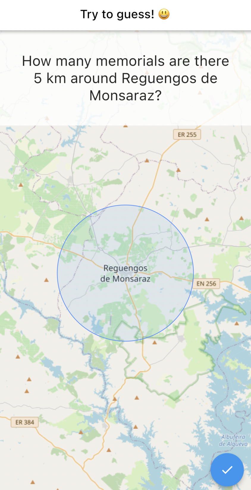
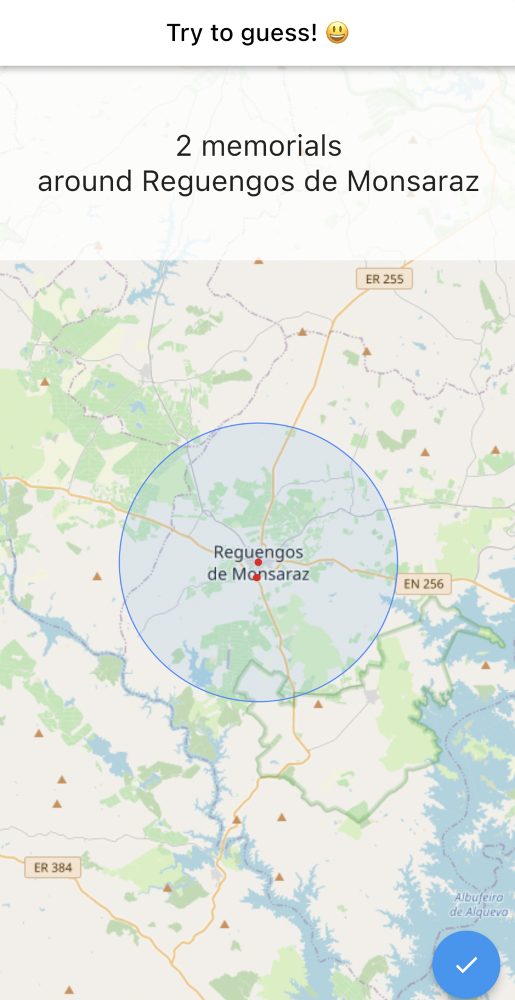
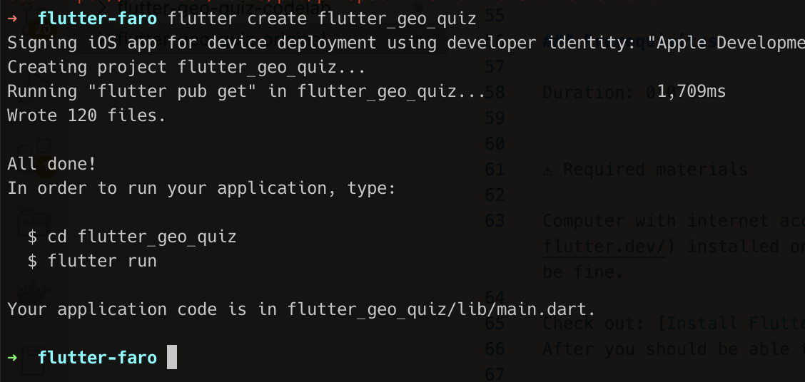
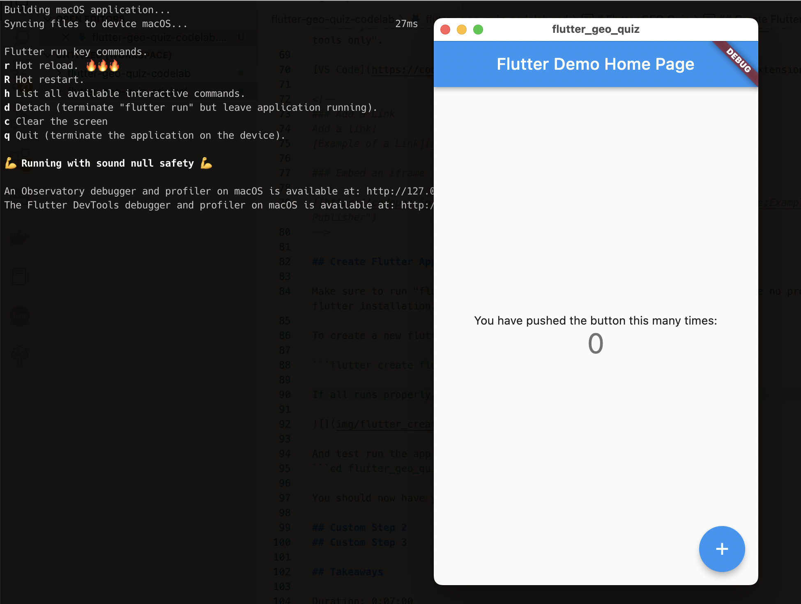
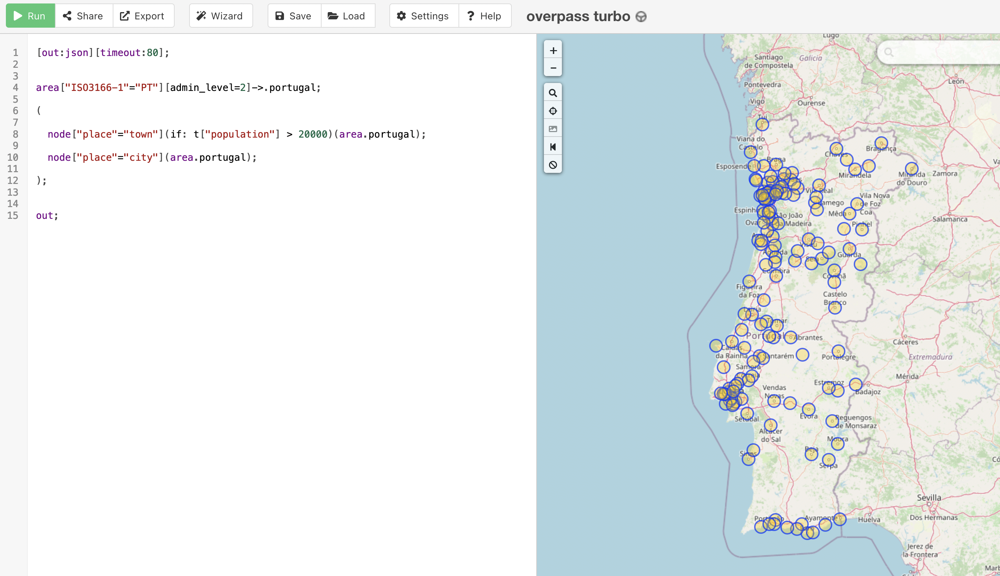
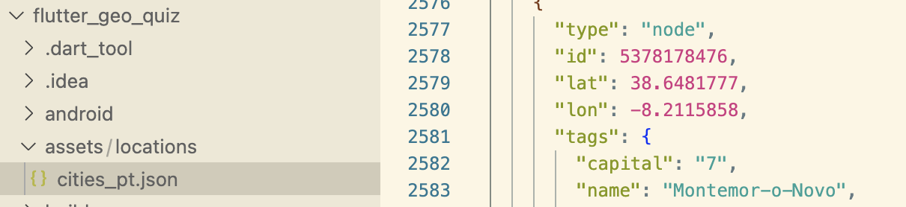
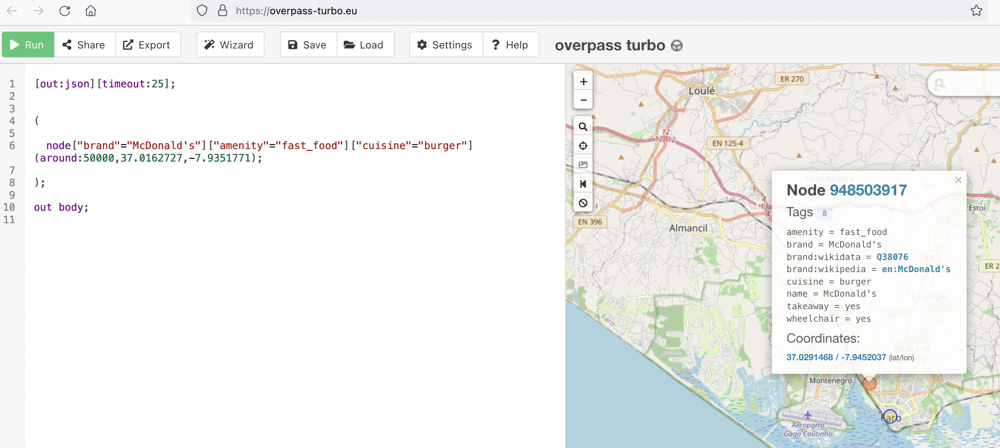
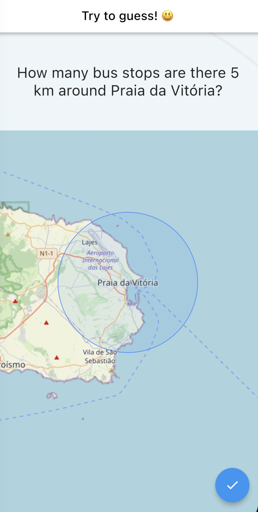

author: Tiago Fernandes
summary:
id: flutter-geo-quiz-codelab
tags:
categories:
environments: Web
status: Published
feedback link: https://github.com/flutter-faro/codelabs/blob/master/markdown/flutter-geo-quiz-codelab

# Flutter Games Workshop - FlutterFaro #2 - Flutter GEO Quiz Code Lab

## What you'll learn: Overview

Duration: 0:05:00

This codelab was created based on Marc Gerken tutorial. You can find it [here](https://www.flutterclutter.dev/flutter/tutorials/creating-a-geo-game/2020/1893/).

The idea is to create a simple single player Quiz Game app with [Flutter](https://flutter.dev) and around GEO/map data. The flutter app will have city data stored and query [OpenStreetMap](https://www.openstreetmap.org/) to fetch information about the quiz questions being made to the user. It will also display a map with a area regarding the quiz question being made to help user to think in the correct answer. The the user will see the correct response (fetched from OpenStreetMap) and will move to the next one.  

So for the next hours we will be learning about how to connect to [OpenStreetMap REST API](https://wiki.openstreetmap.org/wiki/API) (via [Overpass API](https://wiki.openstreetmap.org/wiki/Overpass_API), using [Overpass Query Language](https://wiki.openstreetmap.org/wiki/Overpass_API/Overpass_QL)) to fetch the geo/map data. And how to create a UI to:
* display quiz question
* display map
* display city and area regarding the quiz question
* action button to see see the quiz response
* action button to go to next quiz question

User will see a question screen with the area around a place.


Then by pressing the blue button, the solution will be presented in similar map, showing how many "elements" exist in the area using red dot markers.


<!-- Negative
: This will appear in a yellow info box.

Positive
: This will appear in a green info box. -->

<!-- ### Bullets
Plain Text followed by bullets
* Hello
* CodeLab
* World

### Numbered List
1. List
1. Using
1. Numbers

### Add an Image or a GIF

 -->

## What you need: Prerequisites

### Prerequisites

Duration: 0:07:00


⚠️ Required materials

Computer with internet access :). For the best experience, the laptop should have [Flutter](https://www.flutter.dev/) installed on it prior to starting the codelab to save time. Windows/Linux/Mac would all be fine.

Check out: [Install Flutter](https://flutter.dev/docs/get-started/install)
After you should be able to run `flutter doctor` without any errors.

A device and cable to connect to the laptop (iOS or Android ) OR an Emulator (iOS or Android). For Android you can install [Android Studio](https://developer.android.com/studio) or the "Command line tools only". 

[VS Code](https://code.visualstudio.com/) installed with Dart and Flutter Extensions.

<!-- 
### Add a Link
Add a link!
[Example of a Link](https://www.google.com)

### Embed an iframe


-->

## Create Flutter App

Make sure to run "flutter doctor" to check if everything is ok and there are no problems with your flutter installation.

To create a new flutter app, just run 

```flutter create flutter_geo_quiz```

If all runs properly...



And test run the app by executing
```cd flutter_geo_quiz; flutter run```

You should now have your Flutter demo app running.



## Prepare GEO Data

For this step we are going to use OpenStreetMap to provide the GEO data, using Overpass API. For this we need to use [Overpass Query Language](https://wiki.openstreetmap.org/wiki/Overpass_API/Overpass_QL) to retrieve the data.

Query to getch Portugal data with cities and towns:

```
[out:json][timeout:80];


area["ISO3166-1"="PT"][admin_level=2]->.portugal;

(

  node["place"="town"](if: t["population"] > 20000)(area.portugal);

  node["place"="city"](area.portugal);

);


out;
```

To test and fetch the data, we are going to use [Overpass-turbo](https://overpass-turbo.eu/). It allows to test the query and export the data in OSM format using JSON.

Copy the query to Overpass-turbo and click "RUN"



then click "Export", copy raw OSM data


Now that you have the data in the clipboard, we need to save it somewhere. Create the "assets" directory inside the flutter app, create a sub-directory "locations" and inside a file named "cities_pt.json". Open the "cities_pt.json" file, past data and save file.



This file will be used to pick random city to make quiz questions and retrieve information from OpenstreetMap.

For the flutter app to include this and other asset files, we need to configure the assets path in pubspec.yml

```
assets:
  - assets/locations/
```

## Connecting to GEO Locations

To connecting to the cities and towns GEO data we create a "services/geo_service.dart" file to encapsulate fetching the data from the cities_pt.json file.

On this GeoService class you will find the public method "getLocations()" that will return a list of know locations that are read from the cities_pt.json. For this to happen this class needs to parse the JSON and return a list of Location objects  (with coordinates and location name) to use in the app. 

This JSON Serialization/Deserialization follows Flutter [Serializing JSON inside model class](https://flutter.dev/docs/development/data-and-backend/json#serializing-json-inside-model-classes) guideline.


```
import 'dart:convert';
import 'package:flutter_geo_quiz/models/location.dart';

import 'package:flutter/services.dart' show rootBundle;

class GeoService {

  GeoService({
    this.fileName = 'cities_pt'
  }): assert(fileName != '');

  final String fileName;

  List<Location> _cachedList;

  Future<List<Location>> getLocations() async {
    if (_cachedList == null) {
      Map<dynamic, dynamic> json = await _getJsonFromFile(fileName);
      _cachedList = _jsonToLocations(json);
    }

    return _cachedList;
  }

  Future<Map<dynamic, dynamic>> _getJsonFromFile(String fileName) async {
    String jsonString = await rootBundle.loadString('assets/locations/$fileName.json');

    return jsonDecode(jsonString);
  }

  List<Location> _jsonToLocations(Map<dynamic, dynamic> json) {
    List<Location> locations = [];

    // iterate over the "elements" to get location information from JSON
    for (var element in json["elements"]) {
      locations.add(
        Location.fromJson(element)
      );
    }

    return locations;
  }
}
```

The location class is the object used to encapsulate, you guessed, a location with coordinates and a name. It implements the deserialization with method "fromJson()".

Create the "models/location.dart" file with the Location class.

```
class Location {
  final double longitude;
  final double latitude;
  final String name;

  Location({
    this.longitude,
    this.latitude,
    this.name,
  });


  Location.fromJson(Map<dynamic, dynamic> json) :
    longitude = json['lon'],
    latitude = json['lat'],
    name = json['tags']['name'];

}
```

So all set to access towns and cities information from JSON elements and return a list of Locations. 

## Query entities

When the game starts and to ask a question we need to query about the entities on that question. To do that we will user Overpass QL to query for them around a specific coordinate.

Overpass QL example:
```
[out:json][timeout:25];


(

  node["brand"="McDonald's"]["amenity"="fast_food"]["cuisine"="burger"](around:50000,37.0162727,-7.9351771);

);

out body;
```

You can test this in Overpass-turbo



Now for the flutter app, lets create some models to encapsulate this query.

Create the file "models/overpass_query.dart"
```
class OverpassQuery {

  String output;
  int timeout;
  List<SetElement> elements;

  OverpassQuery({
    this.output,
    this.timeout,
    this.elements
  });


  Map<String, String> toMap() {
    String elementsString = '';

    for (SetElement element in elements) {
      elementsString += '$element;';
    }

    String data = '[out:$output][timeout:$timeout];($elementsString);out;';

    return <String, String> {
      'data': data
    };
  }
}
```

Create the file "models/set_element.dart"
```
class SetElement {
  final Map<String, String> tags;
  final LocationArea area;

  SetElement({
    this.tags,
    this.area
  });

  @override
  String toString() {

    String tagString = '';

    tags.forEach((key, value) {
      tagString += '["$key"="$value"]';
    });

    String areaString = '(around:${area.radius},${area.latitude},${area.longitude})';

    return 'node$tagString$areaString';
  }
}
```


Create the file "models/location_area.dart"
```
class LocationArea {
  final double longitude;
  final double latitude;
  final double radius;

  LocationArea({
    this.longitude,
    this.latitude,
    this.radius
  });
}
```

Create the file "models/response_location.dart"
```
class ResponseLocation {

  double longitude;
  double latitude;
  String name;
  String city;
  String street;

  ResponseLocation({
    this.longitude,
    this.latitude,
    this.name,
    this.city,
    this.street,
  });

  ResponseLocation.fromJson(Map<dynamic, dynamic> json) {

    this.longitude = json['lon'];
    this.latitude = json['lat'];

    Map<String, dynamic> tags = json['tags'];

    if (tags == null) {
      return;
    }

    this.name = json['tags']['name'];
    this.city = json['tags']['addr:city'];
    this.street = json['tags']['addr:street'];
  }
}
```

Create the file "models/query_location.dart"
```
class QueryLocation {
  final double longitude;
  final double latitude;

  QueryLocation({
    this.longitude,
    this.latitude,
  });

}
```

Now that we know how to represent a OverpassQuery, we create the class that will make the Overpass API call to retrieve data.

Create "lib/api" directory and inside the "lib/api/overpass_query.dart" file..
```
import 'dart:convert';

import 'package:xml/xml.dart';
import 'package:http/http.dart';
import '../models/overpass_query.dart';

class OverpassApi {
  static String _apiUrl = 'overpass-api.de';
  static String _path = '/api/interpreter';

  Future<List<ResponseLocation>> fetchLocationsAroundCenter(QueryLocation center, Map<String, String> filter, double radius) async {
    Request request = Request('GET', Uri.https(_apiUrl, _path));

    request.bodyFields = _buildRequestBody(center, filter, radius);

    String responseText;

    try {
      StreamedResponse response = await Client().send(request).timeout(const Duration(seconds: 5));

      responseText = await response.stream.bytesToString();
    }catch (exception) {
      print(exception);
      return Future.error(exception);
    }

    var responseJson;

    try {
      responseJson = jsonDecode(responseText);

    }catch (exception) {

      String error = '';

      final document = XmlDocument.parse(responseText);
      final paragraphs = document.findAllElements("p");

      paragraphs.forEach((element) {
        if (element.text.trim() == '') {
          return;
        }
        error += '${element.text.trim()}';
      });

      return Future.error(error);
    }

    if (responseJson['elements'] == null) {
      return [];
    }

    List<ResponseLocation> resultList = [];

    for (var location in responseJson['elements']) {
      resultList.add(ResponseLocation.fromJson(location));
    }

    return resultList;
  }

  Map<String, String> _buildRequestBody(QueryLocation center, Map<String, String> filter, double radius) {
    OverpassQuery query = new OverpassQuery(
      output: 'json',
      timeout: 25,
      elements: [
        SetElement(
          tags: filter,
          area: LocationArea(
            longitude: center.longitude,
            latitude: center.latitude,
            radius: radius
          )
        )
      ],
    );

    return query.toMap();
  }
}
```

The public method "fetchLocationsAroundCenter()" received a Location, tags (used to filter) and a radius distance in meters.

Now that we have the capacity to query with OverpassAPI class, we need to add this into the GeoService. Open "lib/services/geo_service.dart" file and add the "getEntitiesInArea()" method to it.

```
class GeoService{

  ...

  Future<List<Location>> getEntitiesInArea({ Location center, SearchType type, double radiusInMetres = 5000}) async {
    List<ResponseLocation> fetchResult = await this.overpassApi.fetchLocationsAroundCenter(
      QueryLocation(
        longitude: center.longitude,
        latitude: center.latitude
      ),
      type.tags,
      radiusInMetres
    );

    List<Location> result = [];

    fetchResult.forEach((element) {
      result.add(
        Location(
          longitude: element.longitude,
          latitude: element.latitude,
          name: element.name
        )
      );
    });

    return result;
  }

  ...

}
```

## Search types

The GeoService "getEntitiesInArea()" method expects a SearchType. The idea of the search type is to allow to have different kind of terms to search like bars, trees, fire stations, etc. So when making a query for entities around area we pick randomly chosen search type :)

Create a file inside "assets/search_types.json" which will have a name (singular and plural) and tags to be used in the Overpass query.

```
{
  "elements": [
    {
      "name": {
        "singular": "bar",
        "plural": "bars"
      },
      "tags": {
        "amenity": "bar"
      }
    },
    {
      "name": {
        "singular": "pub",
        "plural": "pubs"
      },
      "tags": {
        "amenty": "pub"
      }
    },
    {
      "name": {
        "singular": "McDonald's",
        "plural": "McDonald's"
      },
      "tags": {
        "brand": "McDonald's",
        "amenity": "fast_food",
        "cuisine": "burger"
      }
    },
    {
      "name": {
        "singular": "street lamp",
        "plural": "street lamps"
      },
      "tags": {
        "highway": "street_lamp"
      }
    },
    {
      "name": {
        "singular": "tree",
        "plural": "trees"
      },
      "tags": {
        "natural": "tree"
      }
    },
    {
      "name": {
        "singular": "memorial",
        "plural": "memorials"
      },
      "tags": {
        "historic": "memorial"
      }
    },
    {
      "name": {
        "singular": "bus stop",
        "plural": "bus stops"
      },
      "tags": {
        "highway": "bus_stop"
      }
    },
    {
      "name": {
        "singular": "fire station",
        "plural": "fire stations"
      },
      "tags": {
        "amenity": "fire_station"
      }
    },
    {
      "name": {
        "singular": "bench",
        "plural": "benches"
      },
      "tags": {
        "amenity": "bench"
      }
    },
    {
      "name": {
        "singular": "village",
        "plural": "villages"
      },
      "tags": {
        "place": "village"
      }
    },
    {
      "name": {
        "singular": "post box",
        "plural": "post boxes"
      },
      "tags": {
        "amenity": "post_box"
      }
    },
    {
      "name": {
        "singular": "recycling container",
        "plural": "recycling containers"
      },
      "tags": {
        "amenity": "recycling"
      }
    }
  ]
}

````

This search_type.json file allows you to extend the game with ease in terms of the questions that can be made to the player.

Add it to the assets in pubspec.yaml
```
  assets:
    - assets/locations/
    - assets/search_types.json
```

Now, similar to GeoService that reads from cities_pt.json file, we need to create a SearchTypeService so that the flutter app can read the search_types.json file.

Create "lib/services/search_type_service.dart"

```
import 'dart:convert';
import 'package:flutter/services.dart' show rootBundle;

class SearchTypeService {
  List<SearchType> _cachedList;

  Future<List<SearchType>> getSearchTypes() async {

    if (_cachedList == null) {
      List<dynamic> json = await _getJsonFromFile('search_types');
      _cachedList = _jsonToSearchTypes(json);
    }

    return _cachedList;
  }

  Future<List<dynamic>> _getJsonFromFile(String fileName) async {
    String jsonString = await rootBundle.loadString('assets/$fileName.json');

    return jsonDecode(jsonString)['elements'];
  }


  List<SearchType> _jsonToSearchTypes(List<dynamic> json) {
    List<SearchType> searchTypes = [];
    for (var element in json) {
      searchTypes.add(
        SearchType.fromJson(element)
      );
    }

    return searchTypes;
  }
}
```

Create the file "lib/models/search_type.dart", used to encalsulate a search type and deserialize the JSON.
```
class SearchType {
  String singular;
  String plural;
  Map<String, String> tags;

  SearchType({
    this.singular,
    this.plural,
    this.tags
  });


  SearchType.fromJson(Map<dynamic, dynamic> json) {

    this.singular = json['name']['singular'];
    this.plural = json['name']['plural'];

    Map<String, String> tags = new Map();

    json['tags'].forEach((key, value) {
      tags[key] = value;
    });

    this.tags = tags;
  }
}

```

## Quiz Screen 

Time for the UI. The flutter app uses OpenstreetMap so we can use [](https://pub.dev/packages/flutter_map) which is an implementation of popular JS library [Leaflet](https://leafletjs.com/). Lets add this and other dependencies to the pubspec.yaml file.

```
...
environment:
  sdk: ">=2.11.0 <3.0.0"

...

dependencies:
  flutter:
    sdk: flutter

  http: 0.12.2
  xml: 4.5.1
  flutter_map: 0.10.1+1
...
```

After saving the pubspec.yaml file click the "Get Packages" button or run "flutter pub get" in the console from inside the flutter app directory.

Now we are ready to implement the quiz widget screen.

Create the directory "lib/screens" and inside the file "quiz.dart" with
```
import 'dart:math';

import 'package:flutter/material.dart';
import 'package:flutter_geo_quiz/api/overpass_api.dart';
import 'package:flutter_geo_quiz/services/geo_service.dart';
import 'package:flutter_geo_quiz/services/search_type_service.dart';
import 'package:flutter_map/flutter_map.dart';
import 'package:latlong/latlong.dart';

import '../models/location.dart';
import '../models/search_type.dart';

class Quiz extends StatefulWidget {
  @override
  _QuizState createState() => _QuizState();
}

class _QuizState extends State<Quiz> {
  final MapController _mapController = new MapController();
  final OverpassApi _overpassApi = new OverpassApi();
  GeoService _geoService;

  List<SearchType> _searchTypes = [];
  List<Location> _locations = [];

  Location _currentLocation;
  List<Location> _entities = [];
  SearchType _currentType;
  bool _answered = false;

  @override
  void initState() {
    _geoService = new GeoService(overpassApi: _overpassApi);

    WidgetsBinding.instance.addPostFrameCallback((timeStamp) async {
      _initialize();
    });

    super.initState();
  }

  @override
  Widget build(BuildContext context) {
    return Scaffold(
      appBar: AppBar(
        backgroundColor: Colors.white,
        title: Center(child: Text("Try to guess! 😃", style: TextStyle(color: Colors.black))),
      ),
      body: Center(
        child: Stack(
          children: [
            _getMap(),
            _getTopContainer()
          ],
        )
      ),
      floatingActionButton: FloatingActionButton(
        onPressed: _proceed,
        child: Icon(Icons.check),
      ),
    );
  }

  void _initialize() async {
    _searchTypes = await SearchTypeService().getSearchTypes();
    _locations = await _geoService.getLocations();

    _getNewLocation();
    _getNewSearchType();
  }

  void _proceed() async {
    if (_answered == true) {
      _showNewQuestion();
      return;
    }

    _answerQuestion();
  }

  void _showNewQuestion() {
    setState(() {
      _getNewLocation();
      _getNewSearchType();
      _entities = [];
      _answered = false;
    });
  }

  Future _answerQuestion() async {
    _indicateLoading();

    _entities = await GeoService(overpassApi: _overpassApi).getEntitiesInArea(
        center: _currentLocation,
        type: _currentType
    );

    Navigator.of(context).pop();

    setState(() {
      _answered = true;
    });
  }

  void _getNewSearchType() {
    _currentType = _searchTypes[Random().nextInt(_searchTypes.length)];
  }

  void _indicateLoading() {
    showDialog(
      context: context,
      barrierDismissible: false,
      builder: (BuildContext context) {
        return AlertDialog(
          shape: RoundedRectangleBorder(
            borderRadius: BorderRadius.all(
              Radius.circular(8.0)
            )
          ),
          content: Container(
            child: Text('Fetching geo data ...', textAlign: TextAlign.center,)
          ),
        );
      }
    );
  }

  void _getNewLocation() {
    if (_locations.isEmpty) {
      return;
    }

    setState(() {
      _currentLocation = _locations[Random().nextInt(_locations.length)];
    });

    _mapController.move(
        new LatLng(_currentLocation.latitude, _currentLocation.longitude),
        11
    );
  }

  FlutterMap _getMap() {
    return FlutterMap(
      mapController: _mapController,
      options: new MapOptions(
        interactive: false,
        center: _currentLocation != null ? new LatLng(_currentLocation.latitude, _currentLocation.longitude) : null,
        zoom: 11,
      ),
      layers: [
        new TileLayerOptions(
            urlTemplate: "https://{s}.tile.openstreetmap.org/{z}/{x}/{y}.png",
            subdomains: ['a', 'b', 'c']
        ),
        new MarkerLayerOptions(
          markers: _getMarkers(),
        ),
        new MarkerLayerOptions(
          markers: _getAreaMarkers(),
        ),
      ],
    );
  }

  List<Marker> _getMarkers() {
    List<Marker> markers = [];

    for (Location location in _entities) {
      markers.add(
          new Marker(
            width: 6,
            height: 6,
            point: new LatLng(location.latitude, location.longitude),
            builder: (ctx) =>
            new Container(
              decoration: BoxDecoration(
                  shape: BoxShape.circle,
                  color: Colors.red
              ),
            ),
          )
      );
    }

    return markers;
  }

  List<Marker> _getAreaMarkers() {
    if (_currentLocation == null) {
      return [];
    }

    return [new Marker(
      width: 230.0,
      height: 230.0,
      point: new LatLng(_currentLocation.latitude, _currentLocation.longitude),
      builder: (ctx) =>
      new Container(
        decoration: BoxDecoration(
            shape: BoxShape.circle,
            color: Colors.blue.withOpacity(0.1),
            border: Border.all(color: Colors.blueAccent)
        ),
      ),
    )];
  }

  Container _getTopContainer() {
    return Container(
      alignment: Alignment.topCenter,
      child: Container(
          padding: EdgeInsets.all(32),
          height: 160,
          alignment: Alignment.center,
          width: double.infinity,
          color: Colors.white.withOpacity(0.8),
          child: Text(
            _getText(),
            style: TextStyle(fontSize: 24),
            textAlign: TextAlign.center,
          )
      ),
    );
  }

  String _getText() {
    if (_currentLocation == null) {
      return '';
    }

    if (_currentType == null) {
      return '';
    }

    if (_answered == false) {
      return "How many ${_currentType.plural} are there 5 km around ${_currentLocation.name}?";
    }

    return "${_entities.length.toString()} ${_currentType.plural}\naround ${_currentLocation.name}";
  }
}
```

## Running the app

Now we need to update the "lib/main.dart" so that it uses the Quiz widget and starts the application in the quiz screen.

Update "lib/main.dart" file
```
import 'package:flutter/material.dart';

import 'screens/quiz.dart';

void main() {
  runApp(MyApp());
}

class MyApp extends StatelessWidget {
  // This widget is the root of your application.
  @override
  Widget build(BuildContext context) {
    return MaterialApp(
      title: 'Flutter GeoGuesser',
      theme: ThemeData(
        primarySwatch: Colors.blue,
        visualDensity: VisualDensity.adaptivePlatformDensity,
      ),
      home: Quiz(),
    );
  }
}
```

After save, just click play button on VS code, run application from Android studio or run from the console inside flutter app directory: flutter run

you should see something similar to this image :)



Now lets discuss a bit this app, should we?

## Takeaways

Hope you had some fun creating this app! 

Thank you for participaging in this codelab! 

If you have any feedback, don't esitate and contact us, we welcome feedback :)


